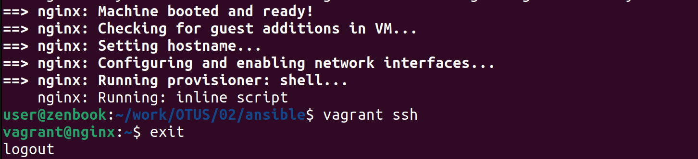
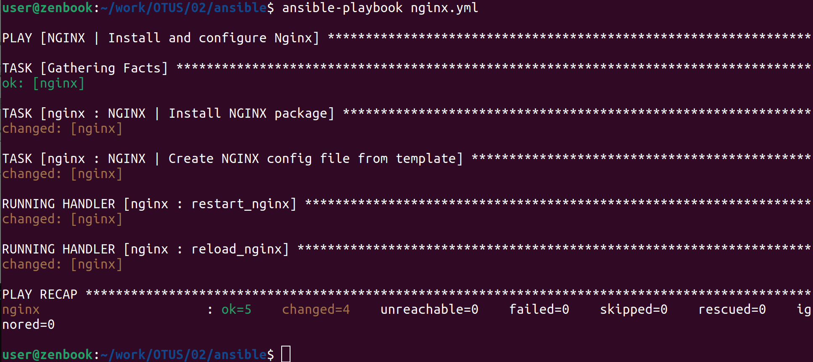
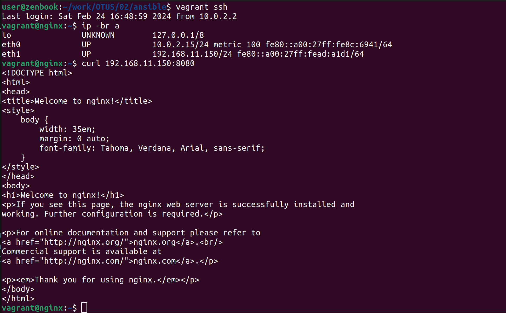

# Домашнее задание 2: Первые шаги с Ansible

## Задание

Подготовить стенд на Vagrant как минимум с одним сервером. На этом сервере используя Ansible необходимо развернуть nginx со следующими условиями:

* необходимо использовать модуль yum/apt;
* конфигурационные файлы должны быть взяты из шаблона jinja2 с перемененными;
* после установки nginx должен быть в режиме enabled в systemd;
* должен быть использован notify для старта nginx после установки;
* сайт должен слушать на нестандартном порту - 8080, для этого использовать переменные в Ansible.

## Выполнение задания

1. Проверим корректность установки Ansible:
```
user@zenbook:~/work/OTUS/02/ansible$ ansible --version
ansible 2.10.8
  config file = /home/user/work/OTUS/02/ansible/ansible.cfg
  configured module search path = ['/home/user/.ansible/plugins/modules', '/usr/share/ansible/plugins/modules']
  ansible python module location = /usr/lib/python3/dist-packages/ansible
  executable location = /usr/bin/ansible
  python version = 3.10.12 (main, Nov 20 2023, 15:14:05) [GCC 11.4.0]
```

2. Поднимем управляемый хост командой `vagrant up` и убедимся, что все прошло успешно и есть доступ по ssh:
```
user@zenbook:~/work/OTUS/02/ansible$ vagrant up
Bringing machine 'nginx' up with 'virtualbox' provider...
==> nginx: Box 'generic/ubuntu2204' could not be found. Attempting to find and install...
    nginx: Box Provider: virtualbox
    nginx: Box Version: >= 0
==> nginx: Loading metadata for box 'generic/ubuntu2204'
    nginx: URL: https://vagrantcloud.com/api/v2/vagrant/generic/ubuntu2204
==> nginx: Adding box 'generic/ubuntu2204' (v4.3.12) for provider: virtualbox (amd64)
    nginx: Downloading: https://vagrantcloud.com/generic/boxes/ubuntu2204/versions/4.3.12/providers/virtualbox/amd64/vagrant.box
    nginx: Calculating and comparing box checksum...
==> nginx: Successfully added box 'generic/ubuntu2204' (v4.3.12) for 'virtualbox (amd64)'!
==> nginx: Importing base box 'generic/ubuntu2204'...
--------------------------------------------------------
----------------ВЫВОД ПРОПУЩЕН--------------------------
--------------------------------------------------------
==> nginx: Machine booted and ready!
==> nginx: Checking for guest additions in VM...
==> nginx: Setting hostname...
==> nginx: Configuring and enabling network interfaces...
==> nginx: Running provisioner: shell...
    nginx: Running: inline script
user@zenbook:~/work/OTUS/02/ansible$ vagrant ssh
vagrant@nginx:~$ exit
logout
```
* Подтвердим скриншотом: 


3. Создадим файлы [ansible.cfg](./HW_02/ansible.cfg) и [hosts](./HW_02/hosts)

4. Проверим работу Ansible на модулях `ping`:

и `command`:


5. Создадим роль Ansible с именем `nginx`:
```
user@zenbook:~/work/OTUS/02/ansible$ ansible-galaxy role init nginx
- Role nginx was created successfully
user@zenbook:~/work/OTUS/02/ansible$ tree ./nginx/
./nginx/
├── defaults
│   └── main.yml
├── handlers
│   └── main.yml
├── meta
│   └── main.yml
├── README.md
├── tasks
│   └── main.yml
├── tests
│   ├── inventory
│   └── test.yml
└── vars
    └── main.yml

6 directories, 8 files
```

6. Создадим файл [nginx.yml](./HW_02/nginx.yml), содержащий роль `nginx`:
```
user@zenbook:~/work/OTUS/02/ansible$ cat nginx.yml 
---
- name: NGINX | Install and configure Nginx
  hosts: web
  become: true
  roles:
    - nginx
```

7. Для созданной роли `nginx` в файл [nginx/handlers/main.yml](./HW_02/nginx/handlers/main.yml) добавим описание двух handler'ов (restart и reload):
```
---
- name: restart_nginx
  systemd:
    name: nginx
    state: restarted
    enabled: yes
- name: reload_nginx
  systemd:
    name: nginx
    state: reloaded
``` 

8. Для созданной роли `nginx` в файл [nginx/templates/nginx.conf.j2](./HW_02/nginx/templates/nginx.conf.j2) добавим шаблон для `nginx`:
```
events {
  worker_connections 1024;
}

http {
  server {
    listen       {{ nginx_listen_port }} default_server;
    server_name  default_server;
    root         /usr/share/nginx/html;

    location / {
    }
  }
}
```

9. Для созданной роли `nginx` в файл [nginx/vars/main.yml](./HW_02/nginx/vars/main.yml) добавим значение переменной порта:
```
nginx_listen_port: 8080
```

10. Для созданной роли `nginx` в файл [nginx/tasks/main.yml](./HW_02/nginx/tasks/main.yml) добавим описания установки `nginx`, копирования конфига и использования `notify`:
```
- name: NGINX | Install NGINX package
  apt:
    name: nginx
    state: latest
  notify:
    - restart_nginx
- name: NGINX | Create NGINX config file from template
  template:
    src: templates/nginx.conf.j2
    dest: /etc/nginx/nginx.conf
  notify: 
    - reload_nginx
```

11. Выполним запуск созданной роли `nginx` на исполнение:
```
user@zenbook:~/work/OTUS/02/ansible$ ansible-playbook nginx.yml

PLAY [NGINX | Install and configure Nginx] ****************************************************************

TASK [Gathering Facts] ************************************************************************************
ok: [nginx]

TASK [nginx : NGINX | Install NGINX package] **************************************************************
changed: [nginx]

TASK [nginx : NGINX | Create NGINX config file from template] *********************************************
changed: [nginx]

RUNNING HANDLER [nginx : restart_nginx] *******************************************************************
changed: [nginx]

RUNNING HANDLER [nginx : reload_nginx] ********************************************************************
changed: [nginx]

PLAY RECAP ************************************************************************************************
nginx                      : ok=5    changed=4    unreachable=0    failed=0    skipped=0    rescued=0    ignored=0   

```

* Подтвердим успешность выполнения скриншотом:


12. Проверим доступность развернутого сайта на порту 8080:
```
user@zenbook:~/work/OTUS/02/ansible$ vagrant ssh
Last login: Sat Feb 24 16:48:59 2024 from 10.0.2.2
vagrant@nginx:~$ ip -br a
lo               UNKNOWN        127.0.0.1/8 
eth0             UP             10.0.2.15/24 metric 100 fe80::a00:27ff:fe8c:6941/64 
eth1             UP             192.168.11.150/24 fe80::a00:27ff:fead:a1d1/64 
vagrant@nginx:~$ curl 192.168.11.150:8080
<!DOCTYPE html>
<html>
<head>
<title>Welcome to nginx!</title>
<style>
    body {
        width: 35em;
        margin: 0 auto;
        font-family: Tahoma, Verdana, Arial, sans-serif;
    }
</style>
</head>
<body>
<h1>Welcome to nginx!</h1>
<p>If you see this page, the nginx web server is successfully installed and
working. Further configuration is required.</p>

<p>For online documentation and support please refer to
<a href="http://nginx.org/">nginx.org</a>.<br/>
Commercial support is available at
<a href="http://nginx.com/">nginx.com</a>.</p>

<p><em>Thank you for using nginx.</em></p>
</body>
</html>
```

* Подтвердим успешность проверки скриншотом:


* Всё работает корректно.

* [Репозиторий с файлами](./HW_02/)