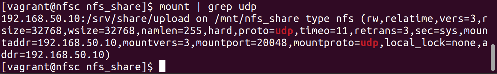

# Домашнее задание 7: Стенд Vagrant с NFS

## Задание

* vagrant up должен поднимать 2 виртуалки: сервер и клиент;
* на сервере должна быть расшарена директория;
* на клиенте она должна автоматически монтироваться при старте (fstab или autofs);
* в шаре должна быть папка upload с правами на запись;
* требования для NFS: NFSv3 по UDP, включенный firewall.

## Выполнение задания

### Запуск виртуальных машин
* Запустим виртуальные машины с помощью [Vagrantfile](./HW_07/Vagrantfile).

### Разработка конфигурации для сервера
1. Выполним установку пакетов для работы с nfs, а также настройку автозапуска для сервиса nfs-server:
```
sudo yum install -y nfs-utils
sudo systemctl enable --now nfs-server
```

2. Создадим директорию для последующей шары, настроим ей владельца, владеющую группу и права доступа:
```
sudo mkdir -p /srv/share/upload
sudo chown -R nfsnobody:nfsnobody /srv/share
sudo chmod 0777 /srv/share/upload
```

3. Добавим информацию о директории в файл `/etc/exports` для её расшаривания:
```
sudo sh -c "echo '/srv/share 192.168.50.11/32(rw,sync,root_squash)' > /etc/exports"
```

4. Включим и добавим в автозапуск брандмауэр:
```
sudo systemctl enable --now firewalld.service
``` 

5. Добавим правила для брандмауэра:
```
sudo firewall-cmd --permanent --add-service=nfs
sudo firewall-cmd --permanent --add-service=rpc-bind
sudo firewall-cmd --permanent --add-service=mountd
sudo firewall-cmd --permanent --add-port=111/udp
sudo firewall-cmd --permanent --add-port=2049/udp
sudo firewall-cmd --permanent --add-port=20048/udp
sudo firewall-cmd --reload
```

### Проверка конфигурации сервера
1. Проверим экспортированную директорию:
```
[root@nfss ~]# exportfs -s
/srv/share  192.168.50.11/32(sync,wdelay,hide,no_subtree_check,sec=sys,rw,secure,root_squash,no_all_squash)
```

2. Проверим состояние брандмауэра:
```
[root@nfss ~]# firewall-cmd --list-services 
dhcpv6-client mountd nfs rpc-bind ssh
[root@nfss ~]# firewall-cmd --list-ports 
111/udp 2049/udp 20048/udp
```

3. Проверим состояние портов:
```
[root@nfss ~]# ss -tunlp | egrep ":111|:2049|^20048"
udp    UNCONN     0      0         *:2049                  *:*                  
udp    UNCONN     0      0         *:111                   *:*                   users:(("rpcbind",pid=374,fd=6))
udp    UNCONN     0      0      [::]:2049               [::]:*                  
udp    UNCONN     0      0      [::]:111                [::]:*                   users:(("rpcbind",pid=374,fd=9))
tcp    LISTEN     0      64        *:2049                  *:*                  
tcp    LISTEN     0      128       *:111                   *:*                   users:(("rpcbind",pid=374,fd=8))
tcp    LISTEN     0      64     [::]:2049               [::]:*                  
tcp    LISTEN     0      128    [::]:111                [::]:*                   users:(("rpcbind",pid=374,fd=11))
```
* Видно, что доступны и TCP-, и UDP-порты для сервиса NFS. Приступим к настройке клиента 

### Разработка конфигурации для клиента
1. Выполним установку пакетов для работы с nfs:
```
sudo yum install -y nfs-utils
```

2. Создадим директорию, которая будет являться точкой монтирования:
```
sudo mkdir -p /mnt/nfs_share
```

3. Выполним пробное монтирование директории с nfs-сервера:
```
sudo mount -t nfs -o vers=3,proto=udp 192.168.50.10:/srv/share/upload /mnt/nfs_share
```

4. Добавим строку для автоматического монтирования с файл /etc/fstab:
```
sudo sh -c 'echo "192.168.50.10:/srv/share/upload /mnt/nfs_share nfs vers=3,proto=udp,noauto,x-systemd.automount 0 0" >> /etc/fstab'
```

5. Выполним перезагрузку клиентской машины:
```
sudo reboot
```

### Проверка работы клиента
1. Проверим опции монтирования директории с nfs-сервера:
```
[vagrant@nfsc nfs_share]$ mount | grep udp
192.168.50.10:/srv/share/upload on /mnt/nfs_share type nfs (rw,relatime,vers=3,rsize=32768,wsize=32768,namlen=255,hard,proto=udp,timeo=11,retrans=3,sec=sys,mountaddr=192.168.50.10,mountvers=3,mountport=20048,mountproto=udp,local_lock=none,addr=192.168.50.10)
[vagrant@nfsc nfs_share]$ 
```

2. Видно, что используется 3-я версия NFS, а в качестве транспортного протокола используется UDP. Подтвердим результат монтирования скриншотом:
.

3. Для проверки на стороне сервера зайдем в расшаренную директорию и создадим файл:
```
[root@nfss ~]# cd /srv/share/upload/
[root@nfss upload]# touch server_file
```

4. На стороне клиента проверим содержимое подмонтированной директории:
```
[root@nfsc ~]# cd /mnt/nfs_share/
[root@nfsc nfs_share]# ls
server_file
```

5. На стороне клиента в подмонтированной директории создадим файл:
```
[root@nfsc nfs_share]# touch client_file
[root@nfsc nfs_share]# 
```

6. На стороне сервера проверим содержимое расшаренной директории:
```
[root@nfss upload]# ls
client_file  server_file
```

7. Видим, что файлы корректно создаются и отображаются как на стороне сервера, так и на стороне клиента.

8. Конфигурационные файлы-скрипты для настройки [NFS-сервера](./HW_07/nfss_script.sh) и [NFS-клиента](./HW_07/nfsc_script.sh). Данные скрипты могут использоваться с [Vagrantfile](./HW_07/Vagrantfile).

